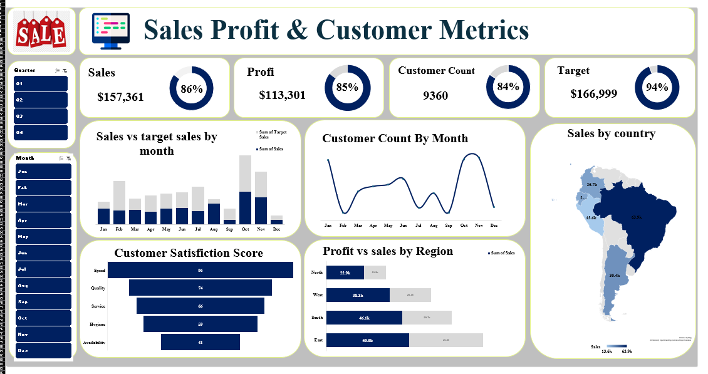

# Sales-Dashboard-Excel
# داشبورد فروش، سود و رضایت مشتری (Sales Profit & Customer Dashboard)

این ریپازیتوری شامل یک داشبورد حرفه‌ای اکسل برای تحلیل داده‌های فروش، سود، تعداد مشتری و نرخ تکمیل اهداف (Target) هست. با استفاده از PivotTable، Slicer و چارت‌های مختلف (مثل Donut برای Target Completion، Map برای فروش کشورها، و Bar برای مقایسه ماهانه)، می‌تونی داده‌ها رو فیلتر و تجزیه کنی. مناسب برای مدیران فروش یا تحلیل‌گران داده.

## ویژگی‌های داشبورد:
- **فیلترهای دینامیک:** Slicer برای Quarter، Month، Region و Customer Satisfaction (Speed, Quality, Hygiene و...).
- **چارت‌ها:** 
  - مقایسه فروش vs Target با Donut (Achieved vs Pending).
  - نقشه فروش کشورها (Brazil, Argentina, Colombia, Ecuador, Peru).
  - نمودارهای Bar و Line برای سود، تعداد مشتری و رضایت.
- **داده‌ها:** بر اساس داده‌های واقعی فروش در آمریکای جنوبی (۶۴ ردیف، شامل Date, Region, Sales, Profit, Target و...).

## فایل‌ها:
- **Sales Profit & Customer Metrics -Data.xlsx**: فایل داده‌های خام (شیت Data با ۶۴ ردیف).
- **Sales Profit & Customer_Dashboard.xlsx**: فایل اصلی داشبورد (شیت‌های PivotTable، Dashboard و pp).
- **Sales.png**: اسکرین‌شات کامل داشبورد (پیش‌نمایش چارت‌ها).
- **persian.png**: تصویر توضیحات اضافی (مثل راهنما به پارسی).

## چطور استفاده کنی:
1. فایل **Sales Profit & Customer_Dashboard.xlsx** رو دانلود و باز کن (Excel 2016+).
2. Slicerها (بالای داشبورد) رو انتخاب کن (مثل Q1 یا Feb) – چارت‌ها خودکار آپدیت می‌شن.
3. **Data > Refresh All** بزن تا داده‌ها بروز بشه.
4. اگر Map Chart خطا داد (در نسخه‌های قدیمی اکسل)، از Filled Map استفاده کن و نام کشورها رو انگلیسی بنویس (Brazil و...).
5. برای ویرایش: شیت "Data" رو تغییر بده و Refresh بزن.

## مشکلات رایج و حل:
- **Donut Target صفر می‌شه با Slicer؟** فرمول‌های KPI رو با IFERROR ایمن کن (مثل `=IF(Target=0, 0, Sales/Target)`).
- **Calculated Field کار نمی‌کنه؟** از سلول دستی خارج Pivot استفاده کن (مثل `=1 - B5/C5` برای Pending).

## نویسنده و تماس:
- ساخته‌شده توسط :Arezoo R 
.

---

*آخرین بروزرسانی: ۲۵ دسامبر ۲۰۲۵*  
*لایسنس: MIT (یا هر لایسنسی که می‌خوای اضافه کن).*
